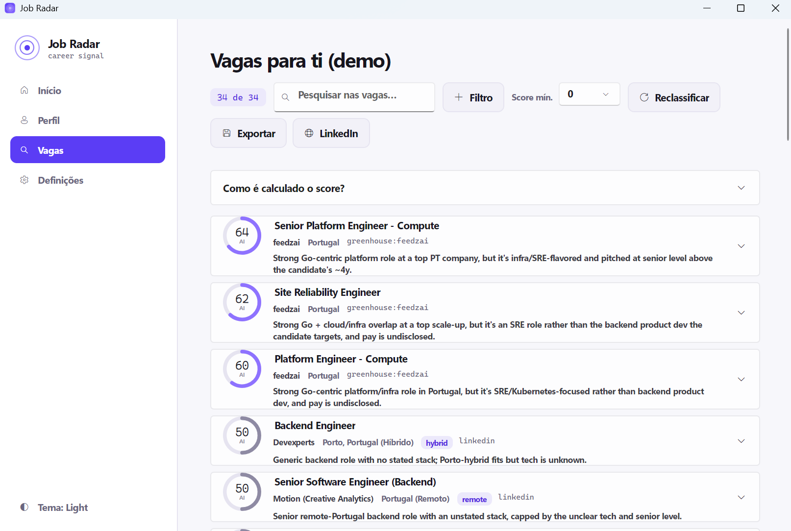

<div align="center">


# Job Radar

**Point your CV at the job market and lock onto the matches that fit.**

A native desktop app that reads your CV, builds your profile with AI, then scans public job boards and
**scores every listing against *you*** — explained, salary-aware, and ranked. Local-first and BYOK.


<sub>Sample CV → search demonstration · mission-control dark theme (a light theme ships too)</sub>

</div>

---

## Install

Grab the latest build from the [**Releases**](../../releases) page — no .NET or Go toolchain needed:

| OS | Download | Notes |
|----|----------|-------|
| **Windows** | `JobRadar-Setup-*-win-x64.exe` | Per-user install (no admin). SmartScreen may warn ("More info → Run anyway") — the app is unsigned. |
| **macOS** | `JobRadar-*-osx-arm64.dmg` (Apple Silicon) / `osx-x64.dmg` (Intel) | First launch: right-click → **Open** to get past Gatekeeper (unsigned). |
| **Linux** | `JobRadar-*-x86_64.AppImage` | `chmod +x` then run. Needs FUSE (most distros have it). |

Each build is self-contained. Your data (profile, settings, plan, cache) is kept in a per-user folder
(`%APPDATA%\JobRadar`, `~/.config/JobRadar`), never inside the install. The AI backend is still BYOK — install
the **Claude CLI** or point it at a local model in **Definições** (without one it falls back to keyword scoring).

> Builds are produced by the [`release`](.github/workflows/release.yml) GitHub Actions workflow on every `v*` tag.

## What it does

- 🛰️ **Profile from your CV** — PdfPig extracts the text; your LLM structures it into field, core skills,
  job titles, seniority and locations. You confirm and add what a CV doesn't say (salary, remote prefs).
  The profile is **saved and reused** — no re-parsing, no wasted tokens.
- 🎯 **Scored against you** — a fast keyword pre-filter, then the LLM scores the top candidates **0–100**
  with a verdict, reasons and red-flags. Off-field roles sink; your stack rises. Toggle **AI** or
  **keyword-only** (instant, zero tokens — still factors stack, work-mode, location and **salary**).
- ◎ **Score dials** — each job shows a circular gauge: green = strong fit, violet = good, grey = maybe.
  Results **stream in live** behind a radar sweep, and already-scored jobs are remembered (no re-spend).
- 🔎 **Search & filters** — search across the listing text, or add structured filters (`+`) like
  *Descrição contém "C#"*, combined with AND.
- 🏢 **Company research** — a key-free web search gathers reviews + comparable salaries; your model
  summarises them into a briefing with **colour-coded pros/cons** and a **personalized salary expectation**
  for your level — with sources.
- 🚩 **Evoluir (career plan)** — **multi-step deep research** (the model picks angles to dig into, then
  searches them) turns your profile + the jobs already scored into a growth plan: strengths, skill gaps with
  actions, target roles, a **salary trajectory** (now → 12–24 months) and time-boxed next steps, with sources.
- 📄 **CV PDF + export** — generate a styled one-page CV from your profile; export results to CSV / HTML / PDF.
- 🔗 **LinkedIn** — open a pre-filled LinkedIn Jobs search, plus an optional (paid, opt-in) **Apify**
  connector with one-click token validation, actor discovery and clear cost warnings.

## Local-first & BYOK

The AI runs on **your** machine — your **Claude CLI** *or* any **OpenAI-compatible local model**
(LM Studio, Ollama, llama.cpp). No API keys to manage, no server, nothing sent to third-party servers.
A **Demo mode** showcases the UI with sample data and never calls an LLM.

## Design language

A deliberate **"mission control"** identity built around the product's name.

| | |
|---|---|
| **Palette** | canvas `#0E0E14` · panel `#16161F` · **accent violet `#7C5CFF`** · **signal green `#3DDC97`** · calm lavender text on dark |
| **Type** | **Inter** for UI · monospace for scores & data |
| **Signature** | the **radar** — concentric-ring brand mark, a sweep animation while scanning, and circular **score dials** |
| **Themes** | dark-first **+** light, system-aware with an in-app toggle (design tokens via Avalonia `ThemeDictionaries`) |
| **Voice** | concise, European-Portuguese UI; errors and empty states guide rather than apologise |

<div align="center"><br/><sub>Light theme</sub></div>

## Architecture

```
┌────────────┐   JSON    ┌──────────────────────┐   profile   ┌──────────────────────┐
│  fetcher/  │ ────────► │   JobRadar.Core      │ ◄────────── │  JobRadar.Desktop     │
│  (Go)      │  jobs     │   (.NET library)     │   results   │  (Avalonia / MVVM)    │
│ concurrent │           │  EF Core / SQLite    │ ──────────► │  sidebar shell · CV   │
│ ingestion  │           │  filter + score      │             │  profile · Vagas ·    │
└────────────┘           │  LLM (CLI or local)  │             │  Evoluir · export     │
                         │  PdfPig · WebSearch  │             └──────────────────────┘
                         └──────────────────────┘
```

Go does the concurrent fetching (its strength); C# orchestrates, persists, scores and renders — a real
workers-feeding-a-core split. The LLM backend is pluggable; web search powers the company briefing.

## Tech

.NET 10 · Avalonia 11 + FluentAvalonia (MVVM, dark/light tokens) · Go 1.23 · EF Core + SQLite · PdfPig ·
Markdown.Avalonia · Claude CLI / OpenAI-compatible local models · Edge headless (PDF)

## Run

Prereqs: **.NET 10 SDK**, **Go 1.23+**, an LLM backend (**Claude CLI** on PATH *or* a local model — optional),
**Edge** (optional, for PDF export).

```bat
dotnet run --project src/JobRadar.Desktop -c Release
```

Upload a CV (real mode) or click **“Ver demonstração”** (demo, no AI). Without an LLM it falls back to
keyword scoring and a manual profile.

## Configure

- **`appsettings.json`** — source weights, salary thresholds, and the LLM backend (`claude` block):
  `provider` = `claude-cli` (default) or `openai` (any OpenAI-compatible local runtime — set `baseUrl`,
  `model`, optional `apiKey`). The model can also be picked from a dropdown in **Definições**.
- **`fetcher-config.json`** — which sources/queries run, Adzuna keys (free), Greenhouse/Lever tokens.
- **LinkedIn via Apify** (optional, **paid**) — enable in **Definições**, paste your Apify token and use
  **“Testar / procurar”** (validates free + auto-fills the actor dropdown). The app warns about cost and
  confirms before each Apify-backed search.

Machine-local settings and secrets stay out of git (`appsettings.local.json`, `profile.json`,
`llm-settings.json`, `ui-settings.json`, `apify-settings.json`).

### Local models (no Claude subscription)
Point `provider` at `openai` and a local runtime — e.g. **LM Studio** (`http://localhost:1234/v1`) or
**Ollama** (`ollama pull llama3.1` → `http://localhost:11434/v1`). A 7–8B instruct model is plenty.

## Limitations

- Scanned/image-only PDFs have no extractable text → fill the profile manually.
- LinkedIn isn't scraped directly (ToS); use the browser shortcut or the opt-in Apify connector.
- Demo mode uses a static sample to showcase the UI without spending tokens.

## Roadmap

Next up: a **CV Studio** (refine the CV, import from LinkedIn/GitHub), a local-model manager, saved searches
with alerts, and one-click installers. See [`ROADMAP.md`](ROADMAP.md).

## License

MIT.
