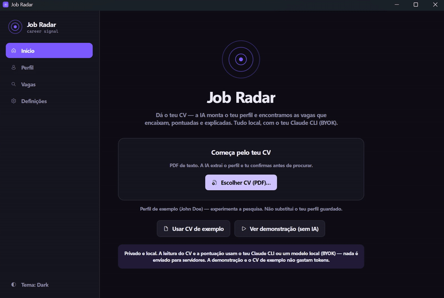

# Job Radar

**Upload your CV → an AI builds your profile → get remote/hybrid jobs that actually fit, scored and ranked — in a clean desktop app.**

Job Radar reads your CV (PDF), uses a local LLM to turn it into a structured profile (which you can edit and refine), then aggregates jobs from public APIs/ATS boards and **scores each one against *your* profile** — tech stack first — so the matches that matter rise to the top.

> Built as a portfolio piece to show **C# / .NET (Avalonia) + Go + AI/automation** working together. Runs entirely on your machine.

<!--  -->
*(Add `docs/demo.gif` + screenshots here.)*

## Why it's different

- 🧠 **Profile from your CV** — PdfPig extracts the text, the **Claude CLI** structures it into stack/skills/seniority/locations; you confirm and answer the few things a CV doesn't say (salary, remote prefs, deal-breakers).
- 🎯 **Stack-first scoring** — a cheap keyword pre-filter, then an LLM scores the top candidates 0–100 with a one-line verdict and reasons. Off-stack roles sink; C#/.NET/Go roles rise.
- 💸 **Zero cost to run / BYOK** — CV parsing and scoring use **your own local Claude CLI** or **any OpenAI-compatible local model** (Ollama, LM Studio, llama.cpp) — no API keys to manage, no server. A **Demo mode** loads sample data and never calls an LLM.
- 🖥️ **Native desktop app** — built with **Avalonia** (Skia-rendered, cross-platform: Windows/macOS/Linux). No webview, no hosting, no backend to maintain.
- 🔌 **No ToS-breaking scraping** — pulls from official APIs / public ATS feeds (Remotive, RemoteOK, Arbeitnow, Adzuna, Greenhouse, Lever).

## Architecture

```
┌────────────┐   JSON    ┌──────────────────┐   profile   ┌─────────────────────┐
│  fetcher/  │ ────────► │  JobRadar.Core   │ ◄────────── │  JobRadar.Desktop    │
│  (Go)      │  jobs     │  (.NET library)  │   results   │  (Avalonia / MVVM)   │
│ concurrent │           │  EF Core/SQLite  │ ──────────► │  CV upload • profile │
│ ingestion  │           │  filter + score  │             │  • dashboard • export│
└────────────┘           │  (Claude CLI)    │             └─────────────────────┘
                         │  PdfPig (CV→text)│
                         └──────────────────┘
```

Go does the concurrent fetching (its strength); C# orchestrates, persists, scores and renders. The split mirrors a real workers-feeding-a-core design.

## Tech

.NET 10 · Avalonia 11 (MVVM, Fluent theme) · Go 1.23 · EF Core + SQLite · PdfPig · Claude CLI · Edge headless (PDF export)

## Run

Prereqs: **.NET 10 SDK**, **Go 1.23+**, **Claude CLI** on PATH (optional — for AI parsing/scoring), **Edge** (optional — PDF export).

```bat
dotnet run --project src/JobRadar.Desktop -c Release
```

- The window opens → **upload a CV** (real mode, uses your Claude CLI) or click **“Ver demonstração”** (demo mode, no AI calls).
- Without the Claude CLI, it falls back to keyword-only scoring and a manual profile.

Exports (CSV + HTML + PDF) are available from the dashboard toolbar.

## Configure

- `appsettings.json` — source weights, salary thresholds, LLM backend.
  - **LLM backend** (`claude` block): `provider` is `claude-cli` (default, uses the local Claude CLI) or
    `openai` for any OpenAI-compatible local model. For `openai`, set `baseUrl` (e.g. Ollama's
    `http://localhost:11434/v1`), `model` (e.g. `llama3.1`) and optionally `apiKey`. Runs fully offline.
- `fetcher-config.json` — which sources/queries run, Adzuna keys (free at developer.adzuna.com), Greenhouse/Lever company tokens.

Secrets stay out of git (`appsettings.local.json`, `.gitignore`).

## Limitations

- Scanned/image-only PDFs have no extractable text → fill the profile manually.
- LinkedIn isn't scraped (ToS); an optional `linkedin-jobs.json` lets you merge a manual pass.
- The Demo mode dataset is a static sample for showcasing the UI without spending tokens.

## Roadmap

Planned next: a **CV Studio** (build/refine a CV, import experience from LinkedIn/GitHub, customizable
PDF output) and an **Improvement** area (AI career plan backed by deep web research). See [`ROADMAP.md`](ROADMAP.md).

## License

MIT.
